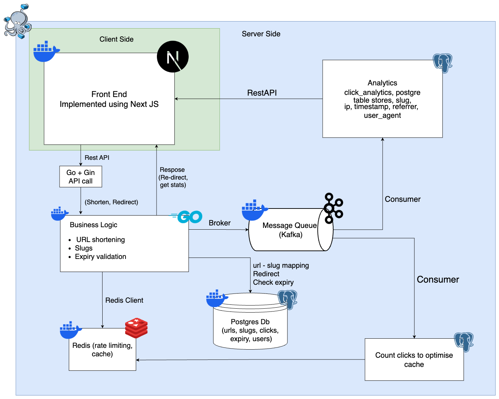

# 🔗 URL Shortener (Scalable & Zero-Tolerance)

A **highly scalable**, **zero-tolerance** URL shortener built with **Go**, **PostgreSQL**, and **Redis**. Designed to be production-ready with support for fault tolerance, high availability, and extensibility.

---

## 🚀 Features

- Convert long URLs to short, unique slugs
- Fast redirection using Redis cache
- Unique slug generation with collision handling
- No data loss (strong DB consistency)
- Rate-limiting and retries
- Ready for containerization and cloud deployment
- Extendable for analytics, expiry, QR codes, etc.

---

## 📈 Flow Chart

## 🧱 Project Structure

<pre> 

url_shortner/
│
├── backend/                     # Go backend for URL shortening service
│   ├── cmd/
│   │   └── server/
│   │       └── main.go          # Entry point: server initialization
│   ├── internal/                # Application core components
│   │   ├── cache/               # Caching logic (Redis)
│   │   ├── handle/              # HTTP request handlers (Gin)
│   │   ├── kafka/               # Kafka integration for event streaming
│   │   ├── middleware/          # Middleware components for HTTP requests
│   │   ├── repository/          # Database interaction layer (Postgres)
│   │   ├── service/             # Business logic and service layer
│   │   └── utils/               # Utility/helper functions
│   ├── proto/
│   │   └── urlshortener.proto   # gRPC definitions for URL shortening service
│   ├── dockerfile               # Dockerfile to containerize backend service
│   ├── go.mod                   # Go module dependencies
│   └── go.sum                   # Dependency checksums
│
├── frontend/                    # Next.js frontend application
│   ├── app/
│   │   ├── global.css           # Global CSS styling
│   │   ├── layout.tsx           # Application layout component
│   │   └── page.tsx             # Main landing page
│   └── components/
│       ├── magicui/             # Custom UI components
│       ├── AnalyticsViewer.tsx  # Component for viewing analytics
│       └── Shorten.tsx          # URL shortening component
│
├── docker-compose.yml           # Docker Compose configuration for easy setup
└── README.md                    # Project overview and setup instructions

</pre>

---

## ⚙️ Tech Stack

- **Language:** Go
- **Database:** PostgreSQL
- **Cache:** Redis
- **Containerization:** Docker
- **API:** REST (option to switch to gRPC)
- **Queue:** Kafka/NATS for analytics

---